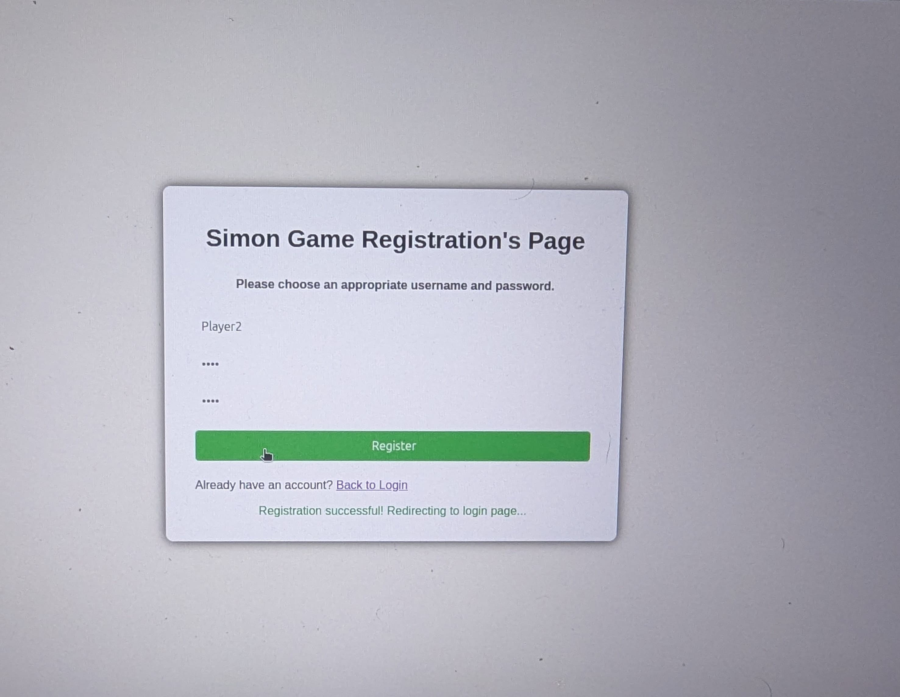
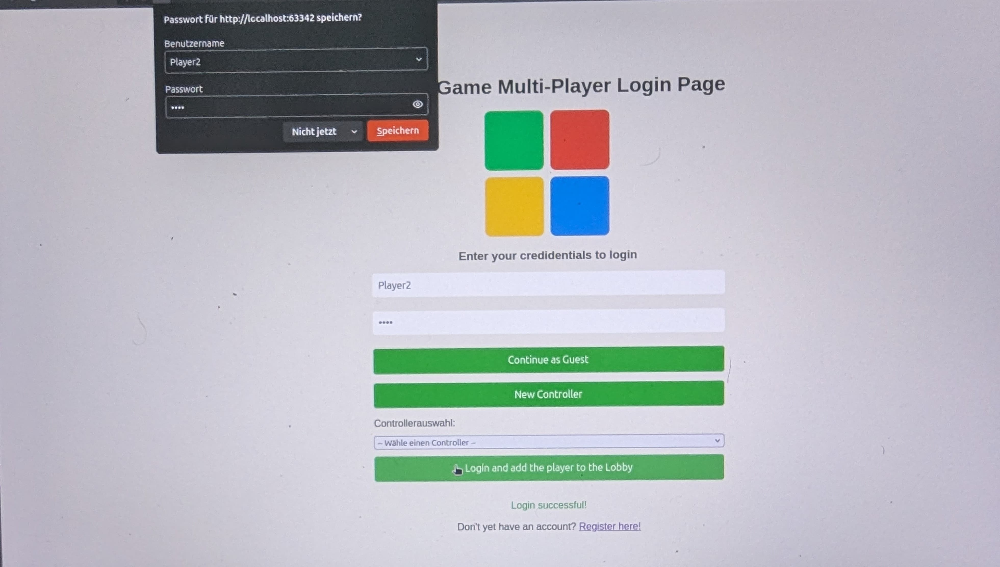
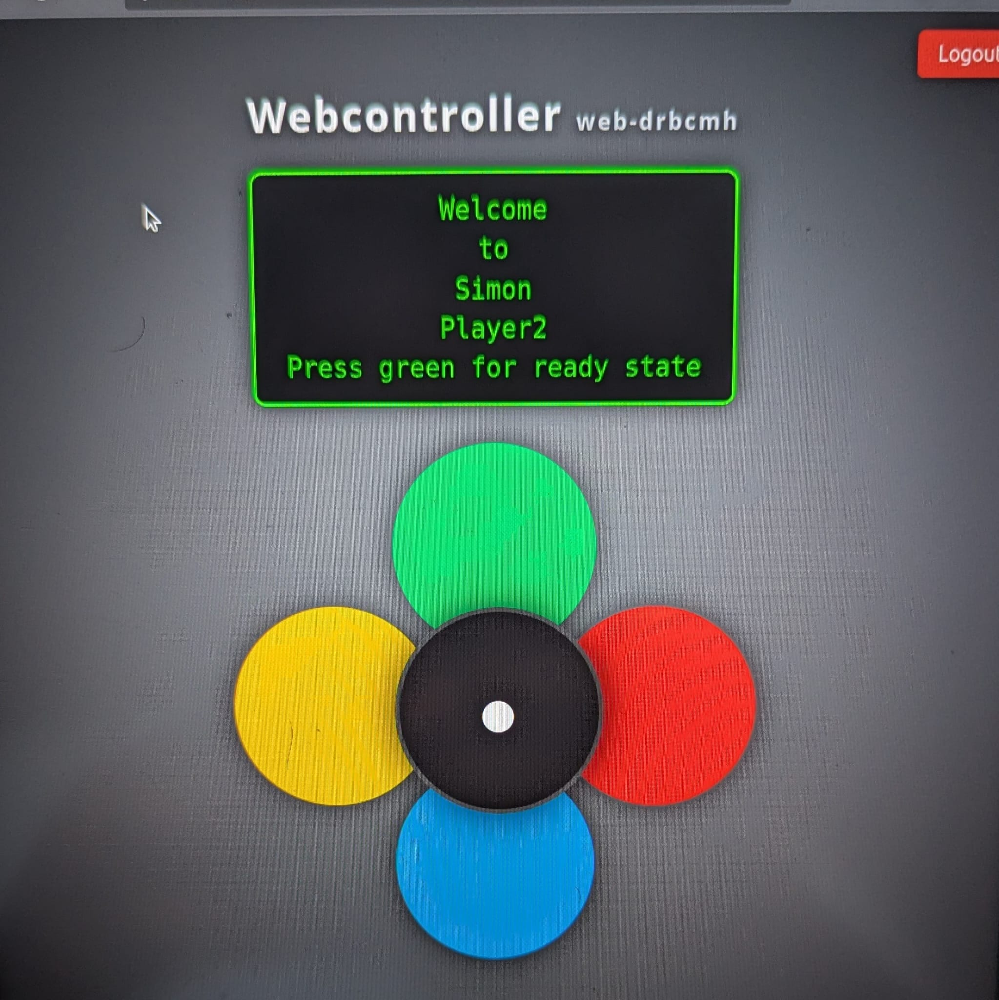
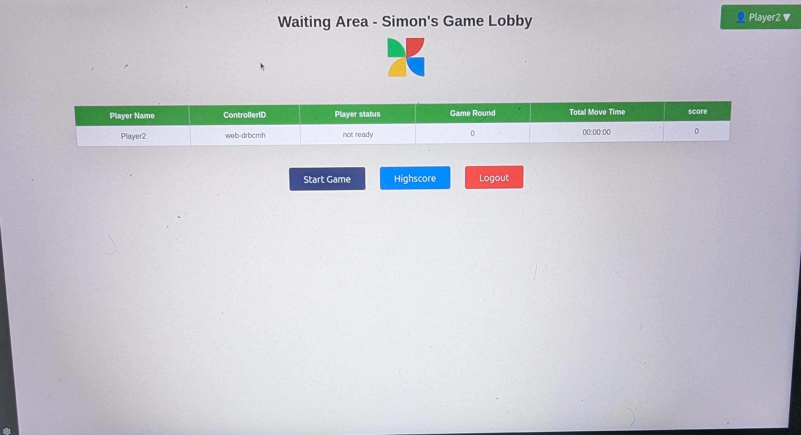
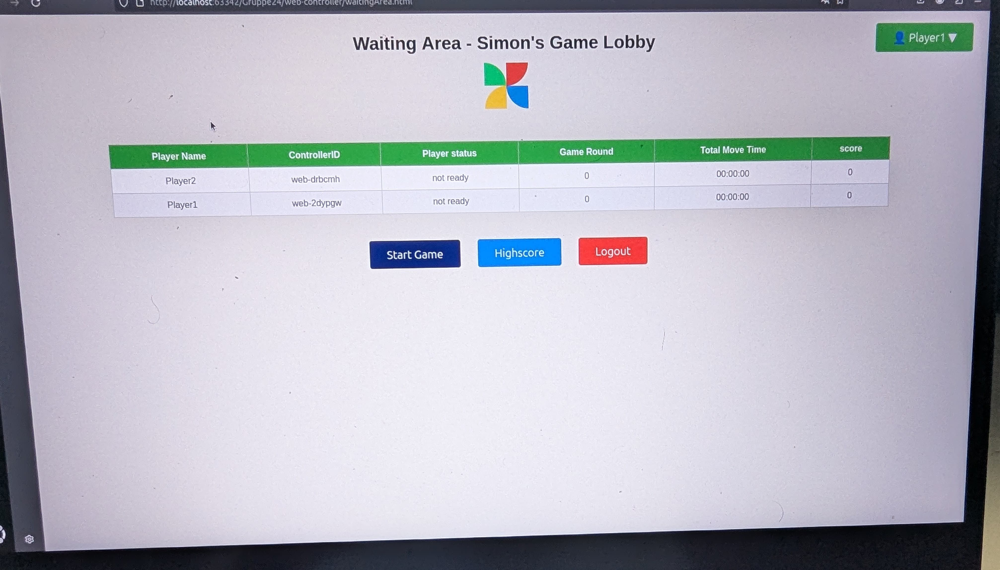
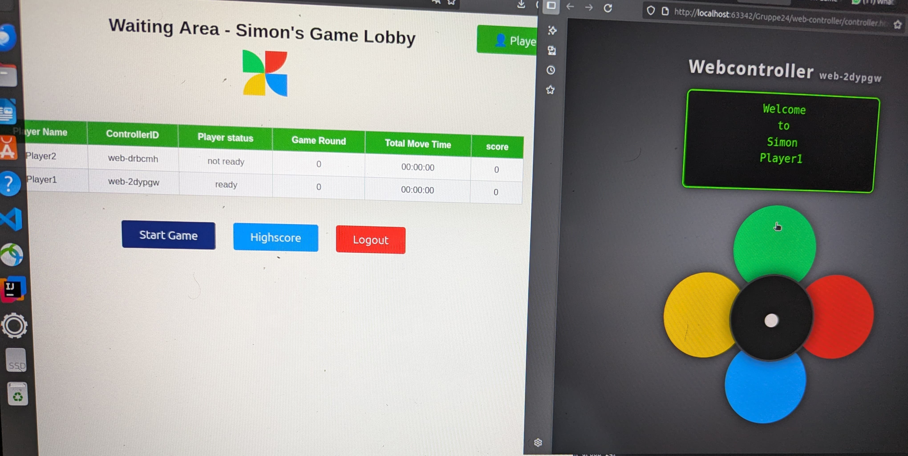
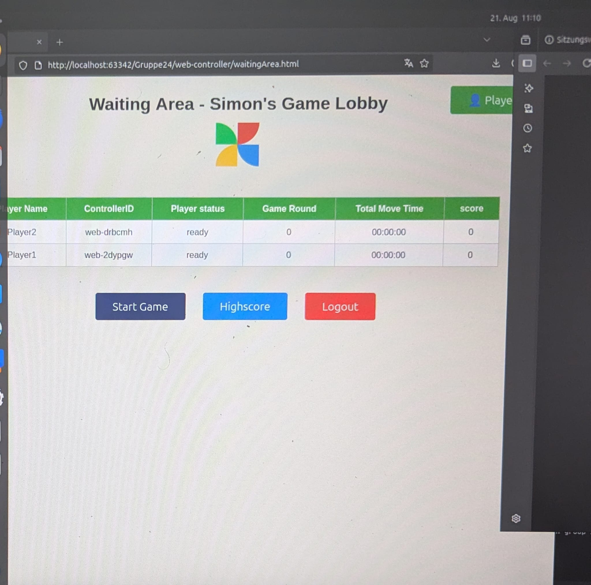
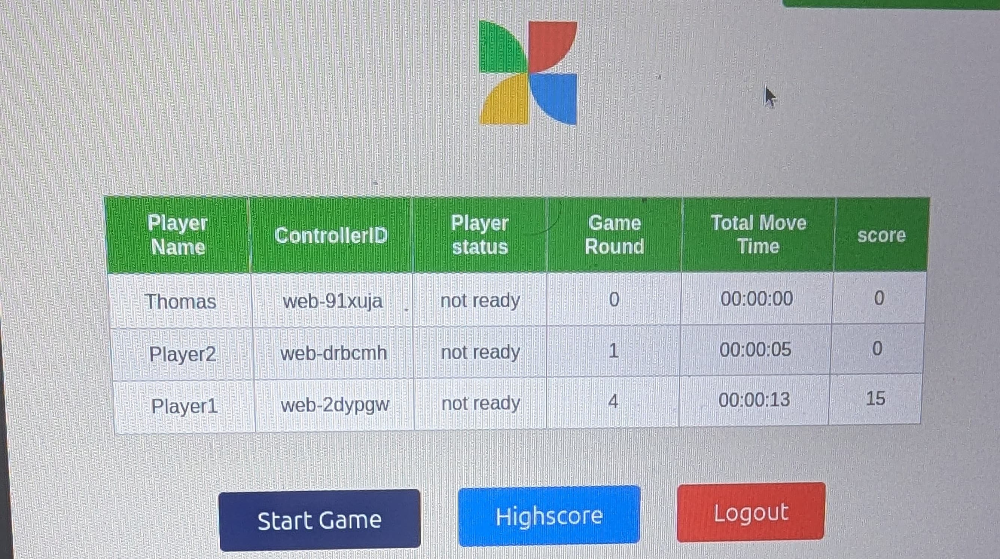
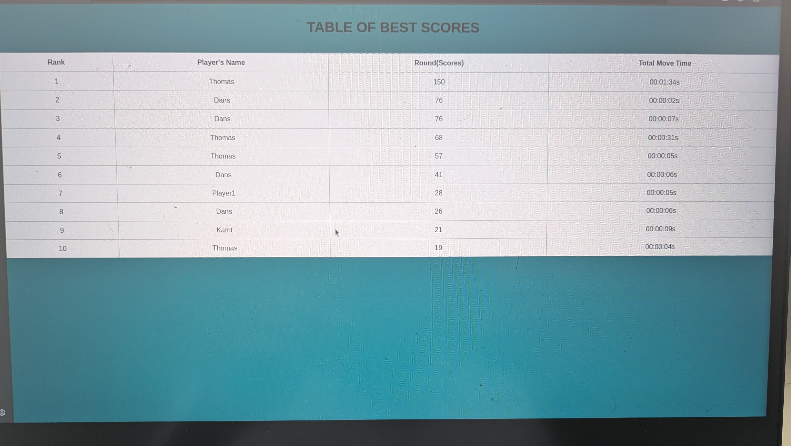

# Simon Game – Project GROUP-24 (Uni Project)


This project implements a **multiplayer Simon game**.  
Players must repeat color sequences that get longer and faster each round.  
The project was completed as a **university project in a group of 2**.

---

## Features

- Multiplayer mode with host and web controllers
- Join as a guest via the browser
- Highscore storage in a database
- Real-time communication between backend and frontend
- MQTT for controller interaction
- Docker setup for easy deployment

---

## Technology Stack

- **Backend:** Java (Vert.x)
- **Database:** MariaDB/MySQL
- **Frontend:** HTML, CSS, JavaScript (in the `web-controller` folder)
- **Communication:** MQTT
- **Containerization:** Docker & Docker Compose

---

## Project Structure (overview)

```plaintext
Group24/
│
├── java-backend/           # Backend (Vert.x + game logic)
│   └── src/main/java/com.example/
│        ├── database/      # Database integration
│        ├── game/          # GameModel, Manager, GameService (game logic)
│        ├── highscore/     # REST API for highscores
│        ├── mqtt/          # MQTT communication
│        └── player/        # REST API for players (Controller, Service, Repository)
│
├── web-controller/         # Frontend (browser controller with HTML, CSS, JS)
│
├── docker-compose.yml      # Docker setup
├── README.md               # Project documentation
└── .gitignore              # Git ignore file

```
---


## Running the Application:

### Environment Variables

In `.env` file you will find the environment variables used in this project. Change the file in the root directory if needed. Default settings are:

```
MQTT_USERNAME=your_mqtt_username
MQTT_PASSWORD=your_mqtt_password
DB_USER=user
DB_PASSWORD=userpassword
DB_ROOT_PASSWORD=rootpassword
DB_NAME=simon_game
DB_HOST=mariadb
DB_PORT=3306
```

### Build and Run the Project

Run `docker compose up --build --watch` whilst in the root directory of this repository.

This command will:

1. Build and start the MariaDB database and phpMyAdmin tool.
2. Build and start the Mosquitto MQTT broker.
3. Build and start the Java backend.
4. Start NGINX and serve the frontend.

If all went fine, you should see prints similar to these:

```
...
✔ Network simon-network   Created
✔ Container mariadb       Started
✔ Container mosquitto     Started
✔ Container phpmyadmin    Started
✔ Container java-backend  Started
✔ Container nginx         Started
```


And the `docker ps` command should list every running container, similar to:

```
...   IMAGE                          ...    STATUS                  ...       NAMES
...   mariadb:latest                 ...    Up About a minute ago   ...       mariadb
...   eclipse-mosquitto:latest       ...    Up About a minute ago   ...       mosquitto
...   phpmyadmin:latest              ...    Up About a minute ago   ...       phpmyadmin
...   java-backend:latest            ...    Up About a minute ago   ...       java-backend
...   nginx:latest                   ...    Up About a minute ago   ...       nginx
```

### Stop the Project

To simply hold execution run `docker compose down` while.
To clean everything you did, run `docker system prune -a --volumes --force`.

> **WARNING**: Keep in mind that `docker system prune` will erase everything you did in docker.

## Accessing the Game

### For Hosts

- Hosts start the game via the lobby page once at least two players are ready.

### For Players (non-hosts)

- Non-host players only need the controller page to participate.
- Open `controller.html` in your browser (or the corresponding URL if served via a web server).
- The controller page automatically connects to the game and allows you to send input live.
- The associated JavaScript handles communication with the backend and sends your actions.

This allows participation in the multiplayer game easily, without extra permissions.

> **Important Note:**  
> All players (except the host) must be authorized by the host before starting the game.

- Each non-host player must log in first to establish the connection between player and controller.
- After successful login, players are redirected to the waiting area, where they wait for the game to start.
- The host can only start the game when at least two players are ready.

This process ensures the multiplayer game runs smoothly and synchronously.

## Application Walkthrough

The following screenshots demonstrate the main features of the Simon Multiplayer Game step by step.  
They provide a quick overview of the user journey — from login, lobby, and game start to the final results.
This walkthrough demonstrates the functionality of the Simon Multiplayer Game, proving that the project is fully operational.

### 1. Registration
A new user can register with a username and password.  


---
### 2. Login
Users can log in with their registered credentials.  


---

### 3. Controller View
After logging in, the selected web controller is personalized with the given username.  


---

### 4. Lobby
After a successful login, the user is redirected to the lobby where they can either join an existing game or start a new one.  


#### 4.1 Lobby view after the second player joins


---

### 5. Game Start
The Simon multiplayer game begins once at least two players are connected.  
Players can set their status to **Ready** by pressing the green button.
  

#### 5.1 Live Demo


---


### 6. Guest Mode
You can also log in as a guest to watch the game without playing.
### 6.1 Live Demo


### 7. Results
At the end of the game, the results of all players are displayed.  


---

### 8. Highscore
To check the top 10 high scores, click on **Highscore**.

