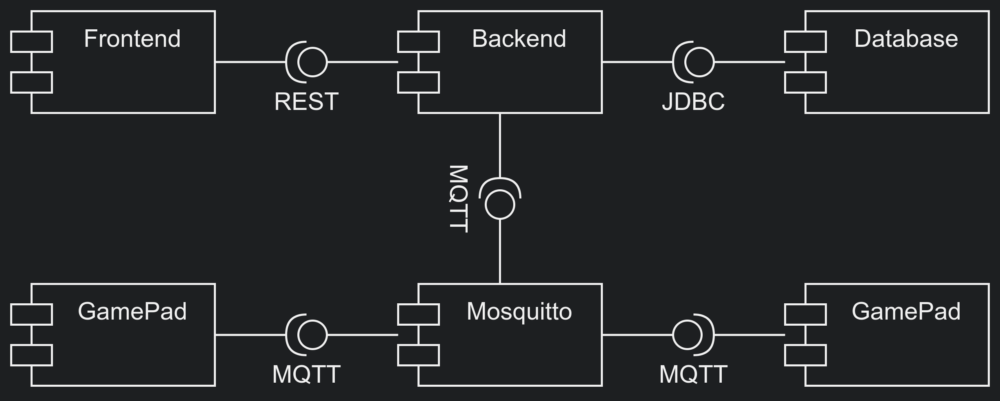

# Informatics Project "Simon Goes Multiplayer" - Summer Semester 2025

This repository contains a project where students will program an ESP32 microcontroller to implement the "Simon" game.
The game data will be sent via MQTT to an MQTT broker and then forwarded to a backend application.
The backend is implemented in Java using Vert.x (REST API) and uses MariaDB.
The frontend is a static site (JS, HTML, CSS) and uses Bootstrap for styling.

> **WARNING**: This repository only provides a skeleton for your own implementation. <br>
> The existing code base should be understood as a Proof-Of-Concept implementing the required communication channels, demonstrating how to connect the different sub-projects and does not prescribe any required functionality.


## [Project Introduction](./doc/Project-Introduction.md)

## [User Stories](./doc/User-Stories.md)

## Table of Contents

- [Technologies Used](#technologies-used)
- [Project Structure](#project-structure)
- [Setup Instructions](#setup-instructions)
  - [Prerequisites](#prerequisites)
    - [Linux](#use-a-linux-based-os)
    - [Docker](#install-docker)
    - [Git](#add-an-ssh-key-to-gitlab)
  - [Clone the Repository](#clone-the-repository)
  - [Environment Variables](#environment-variables)
  - [Build and Run the Project](#build-and-run-the-project)
  - [Accessing the Application](#accessing-the-application)
- [Detailed Explanation](#detailed-explanation)
  - [Backend](#backend)
  - [Frontend](#frontend)
  - [ESP32 Microcontroller](#esp32-microcontroller)
- [Usage](#usage)
  - [Testing the API](#testing-the-api)
  - [Sending MQTT Messages](#sending-mqtt-messages)
- [Troubleshooting](#troubleshooting)
- [Contributing](#contributing)
- [License](#license)

## Technologies Used

- **Java**: Programming language for the backend.
- **Vert.x**: Toolkit for building reactive applications on the JVM.
- **MariaDB**: Relational database management system.
- **Docker**: Platform for developing, shipping, and running applications in containers.
- **MQTT**: Lightweight messaging protocol for small sensors and mobile devices.
- **Bootstrap**: CSS framework for developing responsive and mobile-first websites.
- **ESP32**: Low-cost, low-power system on a chip microcontroller with integrated Wi-Fi and dual-mode Bluetooth.

## Component-Architecture



## Setup Instructions

### Prerequisites

#### Use a linux based OS

Either install a separate linux distro as a dual-boot (preferably Ubuntu, see [here for more information](https://wiki.ubuntuusers.de/Dualboot/)),
or try your luck with [Windows WSL](https://learn.microsoft.com/en-us/windows/wsl/install) feature.

> **WARNING**: We can and will only strongly support native / dual-boot installations of Ubuntu.

#### Install Docker

Follow the instructions for your operating system found [here](https://docs.docker.com/desktop/).

#### Add an SSH-Key to GitLab

To authenticate against our GitLab-Instance, please follow the instructions found [here](https://git.thm.de/help/user/ssh).

### Clone the Repository

1. Open a terminal or command prompt.
2. Clone the repository:

   ```bash
   git clone <YourGitlabProject-URL>
   cd <TheCreatedFolder>
   ```

### Environment Variables

In `.env` file you will find the environment variables used in this project. Change the file in the root directory if needed. Default settings are:

```
MQTT_USERNAME=your_mqtt_username
MQTT_PASSWORD=your_mqtt_password
DB_USER=user
DB_PASSWORD=userpassword
DB_ROOT_PASSWORD=rootpassword
DB_NAME=simon_game
DB_HOST=mariadb
DB_PORT=3306
```

### Build and Run the Project

Run `docker compose up --build --watch` whilst in the root directory of this repository.

This command will:

1. Build and start the MariaDB database and phpMyAdmin tool.
2. Build and start the Mosquitto MQTT broker.
3. Build and start the Java backend.
4. Start NGINX and serve the frontend.

If all went fine, you should see prints similar to these:

```
...
✔ Network simon-network   Created
✔ Container mariadb       Started
✔ Container mosquitto     Started
✔ Container phpmyadmin    Started
✔ Container java-backend  Started
✔ Container nginx         Started
```


And the `docker ps` command should list every running container, similar to:

```
...   IMAGE                          ...    STATUS                  ...       NAMES
...   mariadb:latest                 ...    Up About a minute ago   ...       mariadb
...   eclipse-mosquitto:latest       ...    Up About a minute ago   ...       mosquitto
...   phpmyadmin:latest              ...    Up About a minute ago   ...       phpmyadmin
...   java-backend:latest            ...    Up About a minute ago   ...       java-backend
...   nginx:latest                   ...    Up About a minute ago   ...       nginx
```

### Stop the Project

To simply hold execution run `docker compose down` while.
To clean everything you did, run `docker system prune -a --volumes --force`.

> **WARNING**: Keep in mind that `docker system prune` will erase everything you did in docker.

### Accessing the Application

| Service    | Port            | URL                       |
|------------|-----------------|---------------------------|
| Frontend   | `80` / `443`    | http://localhost          |
| Web-Controller   | `80` / `443`    | http://localhost/controller/controller.html          |
| phpMyAdmin | `8081`          | http://localhost:8081     |
| Backend    | `8080`          | http://localhost:8080/api |
| MariaDB    | `3306`          | --- n/a ---               |
| MOSQUITTO  | `1883` / `9001` | --- n/a ---               |


## [Detailed Explanation](./doc/Explanation.md)

## Troubleshooting

- **Database Connection Issues**: Ensure that the database service is running and the environment variables are correctly set.
- **MQTT Connection Issues**: Ensure that the MQTT broker service is running and the credentials are correctly set. Ensure your firewall not blocking MQTT.
- **Build Issues**: Ensure that you have the correct versions of Docker and Docker Compose installed.

