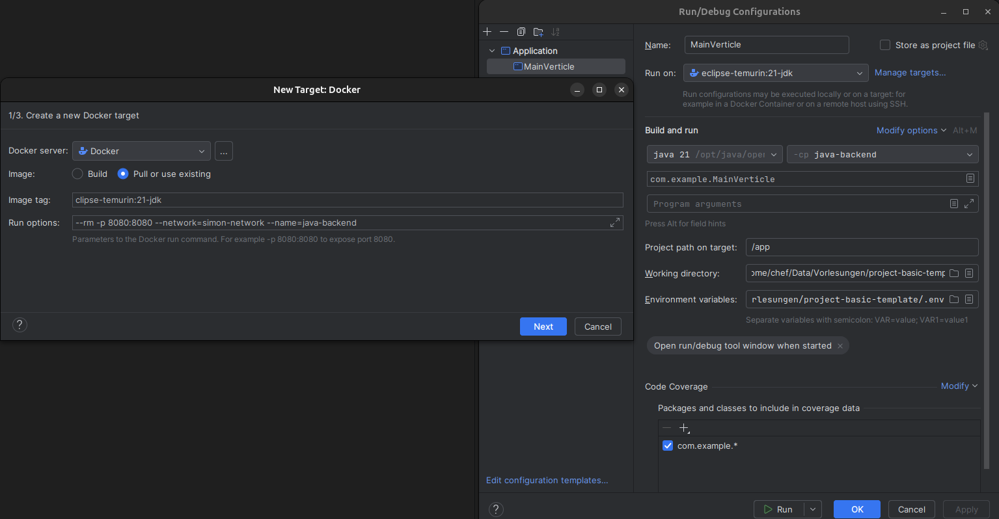

# Debugging the java-backend in IntelliJ 

**There is a comfortable way to debug the project in IntelliJ by using a docker container as run target.**

1. Create a Run/Debug Configuration for MainVerticle.java 
    - Change "Run on:" to Docker and fill in the form according to the screenshot
        - Select "Pull or use existing"
        - image tag: `eclipse-temurin:21-jdk`
        - Run options: `--rm -p 8080:8080 --network=simon-network --name=java-backend`
        - Click OK to save the changes
    - Add the .env file of the project as "Environment variables"
    - Save the settings
    - 
2. Open a terminal and start the docker services except the java-backend: ```docker compose up --no-deps --build -d mosquitto mariadb phpmyadmin nginx```
3. Start the Run/Debug Configuration for MainVerticle.java