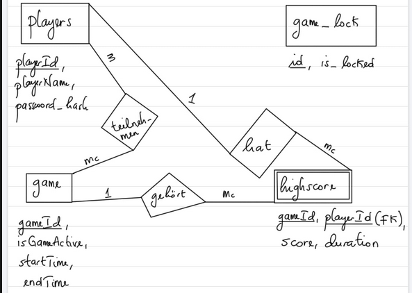

# Simon-Spiel Projekt GROUP-24
Dieses Projekt implementiert ein Mehrspieler-Simon-Spiel mit einem Java-Backend basierend auf Vert.x, einer SQL-Datenbank für die Persistenz und einem Frontend für die Benutzerinteraktion. Das Spiel folgt dem klassischen Simon-Muster, bei dem Spieler eine Farbsequenz nachbilden müssen, wobei die Runden zunehmend schwieriger werden. Das Backend verwaltet den Spielstatus, Spielereingaben und die Punktvergabe und kommuniziert über einen Event-Bus mit dem Frontend.
Die Anwendung wird mit Docker Compose bereitgestellt.

Anwendung starten

## Voraussetzungen

Docker: Installierte Docker-Engine (Version 20.10 oder höher)

Docker Compose: Version 1.29 oder höher

Git: Zum Klonen des Repositories

## Installation und Start

Repository klonen:

   ```bash
       git clone <git@git.thm.de:gen1002-informatik-projekt-sose25/student-project-work/group-24.git>
       cd <TheCreatedFolder>
   ```
## Anwendung starten:

Führen Sie im Projektverzeichnis aus:

`docker compose up --build --watch`

Dies startet das Backend (Port 8080), die Datenbank (Port 3306) und das Frontend Port 8080.


## Zugriff auf das Spiel:

**Für Hosts:**

- Hosts starten das Spiel über die Lobby-Seite, nachdem mindestens zwei Spieler bereit sind.

**Für Spieler (nicht Hosts):**

- Wenn du kein Host bist, benötigst du nur die Controller-Seite, um am Spiel teilzunehmen.
- Öffne dazu die Datei `controller.html` in deinem Browser (oder die entsprechende URL, falls über Webserver verfügbar).
- Die Controller-Seite verbindet sich automatisch mit dem Spiel und ermöglicht es dir, deine Eingaben live zu senden.
- Die zugehörige `Javascript-Datei` sorgt für die Kommunikation mit dem Backend und das Übertragen deiner Aktionen.

So kannst du unkompliziert und ohne zusätzliche Rechte am Multiplayer-Spiel teilnehmen.

---
**Hinweis:**  
---

**Wichtiger Hinweis:**  
Vor dem Spielstart müssen sich alle Spieler (außer dem Host) vom Host autorisieren lassen.  
Das bedeutet:

- Jeder Nicht-Host-Spieler muss sich zuerst  anmelden lassen, damit die Verbindung zwischen Spieler und Controller hergestellt wird.
- Nach erfolgreicher Anmeldung werden die Spieler in den Wartebereich weitergeleitet, wo sie auf den Spielstart warten.
- Erst wenn mindestens zwei Spieler bereit sind, kann der Host das Spiel starten.

Dieser Prozess stellt sicher, dass das Multiplayer-Spiel synchron und reibungslos abläuft.

## Anwendung stoppen:

`docker compose down`

## ERM-Diagramm



## Datenbank ERM und Beschreibung

## Tabellenübersicht

### Tabelle: `players`
- `playerId` (INT UNSIGNED, PRIMARY KEY, AUTO_INCREMENT): Eindeutige Spieler-ID
- `playerName` (VARCHAR(100), UNIQUE, NOT NULL): Name des Spielers, darf nicht leer sein
- `password_hash` (VARCHAR(255), NOT NULL): Gehashter Passwortwert, darf nicht leer sein

### Tabelle: `game_lock`
- `id` (INT, PRIMARY KEY): Identifikator für das Locksystem (meist 1)
- `is_locked` (BOOLEAN, NOT NULL): Status, ob ein Spiel aktiv gesperrt ist

### Tabelle: `game`
- `gameId` (VARCHAR(50), PRIMARY KEY): Eindeutige Spiel-ID
- `isGameActive` (BOOLEAN, DEFAULT FALSE): Status, ob das Spiel aktiv ist
- `startTime` (DATETIME, DEFAULT CURRENT_TIMESTAMP): Startzeit des Spiels
- `endTime` (DATETIME, NULLABLE): Endzeit des Spiels

### Tabelle: `highScore`
- `gameId` (VARCHAR(50)): Fremdschlüssel auf `game.gameId`
- `score` (INT, DEFAULT 0): Punktestand des Spielers im Spiel
- `playerId` (INT UNSIGNED): Fremdschlüssel auf `players.playerId`
- `duration` (TIME): Spielzeit-Dauer
- PRIMARY KEY: Kombination aus `gameId` und `playerId`

## ERM-Darstellung und Kardinalitäten

- Ein Spieler (`players`) kann in mehreren Spielen (`game`) teilnehmen und damit mehrere Highscores (`highScore`) erzielen.
- Ein Spiel (`game`) kann mehrere Spieler (`players`) haben, die darin punkten, also mehrere Einträge in `highScore`.
- `highScore` ist eine schwache Beziehung (abhängige Entität), da sie durch den Fremdschlüssel `gameId` und `playerId` eindeutig definiert wird.
- `game_lock` steuert unabhängig, ob ein Spiel gesperrt ist oder nicht (zentrale Steuerung, Single-Row-Tabelle).

### Kardinalitäten im Detail:

| Beziehung           | Kardinalität               |
|---------------------|----------------------------|
| `players` zu `highScore` | 1 Spieler : 0..* Highscores |
| `game` zu `highScore`    | 1 Spiel : 0..* Highscores   |
| `game_lock` (Singleton)  | 1 Eintrag: 1 Status         |

---


## RESTful API-Beschreibung für das Simon-Spiel

Die Simon Game API ermöglicht die Verwaltung von Spielern, Controllern, Spielsitzungen und Highscores für das Mehrspieler-Simon-Spiel. Die API basiert auf REST-Prinzipien und verwendet JSON für die Datenübertragung. Der Server läuft standardmäßig unter http://localhost:8080. Nachfolgend sind alle verfügbaren Endpunkte auf Deutsch beschrieben.

Endpunkte

### 1. POST /api/players/register

Zusammenfassung: Registriert einen neuen Spieler.

Beschreibung: Erstellt einen neuen Spieler mit einem Benutzernamen und Passwort.

Tags: Spieler

Request Body:

`{

    "playerName": "JohnDoe",
    "password": "password123"
}`

playerName (erforderlich): Benutzername des Spielers (String, z. B. "JohnDoe").

password (erforderlich): Passwort des Spielers (String, z. B. "password123").

Antworten:


201 Created:

`
{
    "message": "Spieler erfolgreich erstellt"
}`

Beschreibung: Spieler wurde erfolgreich registriert.


400 Bad Request:

`
{
"error": "Ungültige Eingabe"
}
`
Beschreibung: Ungültige oder fehlende Eingabedaten.

### 2. POST /api/players/login
Zusammenfassung: Spieler anmelden.

Beschreibung: Meldet einen Spieler mit Benutzernamen, Passwort und Controller-ID an.

Tags: Spieler

Request Body:

`
{

    "playerName": "JohnDoe",
    "password": "password123",
    "controllerId": "ctrl-1234"
}
`

playerName (erforderlich): Benutzername des Spielers (String, z. B. "JohnDoe").

password (erforderlich): Passwort des Spielers (String, z. B. "password123").

controllerId (erforderlich): ID des zugeordneten Controllers (String, z. B. "ctrl-1234").

Antworten:

201 Created:

`
{

    "message": "Anmeldung erfolgreich",
    "playerId": "42",
    "playerName": "JohnDoe"
}
`

Beschreibung: Spieler wurde erfolgreich angemeldet.


400 Bad Request:

`
{
    "error": "Ungültige Anmeldedaten"
}
`

Beschreibung: Ungültige Benutzername/Passwort-Kombination oder fehlende Controller-ID.

### 3. PATCH /api/players/updateProfile

Zusammenfassung: Passwort eines Spielers aktualisieren.

Beschreibung: Aktualisiert das Passwort eines Spielers anhand der Spieler-ID.

Tags: Spieler

Request Body:

`
{

    "id": "42",
    "password": "newPassword123"
}
`

id (erforderlich): ID des Spielers (String, z. B. "42").

password (erforderlich): Neues Passwort (String, z. B. "newPassword123").

Antworten:

200 OK:

`
{

    "message": "Profil erfolgreich aktualisiert"
}
`

Beschreibung: Passwort wurde erfolgreich aktualisiert.

400 Bad Request:

`
{
    "error": "Fehlende oder ungültige Felder"
}
`

Beschreibung: Ungültige oder fehlende Eingabedaten.

### 4. GET /api/waitingArea

Zusammenfassung: Spieler im Wartebereich abrufen.

Beschreibung: Gibt eine Liste der Spieler zurück, die sich aktuell im Wartebereich befinden.

Antworten:

200 OK:

`
[
    {

        "playerName": "Thierry",
        "controllerId": "controller-123",
        "playerStatus": true,
        "gameRound": 1,
        "totalMoveTime": 30000

 }
]
`

Beschreibung: Liste der Spieler im Wartebereich mit ihren Details.

playerName: Name des Spielers (String, z. B. "Thierry").

controllerId: ID des zugeordneten Controllers (String, z. B. "controller-123").

playerStatus: Bereitschaftsstatus des Spielers (Boolean, z. B. true für bereit).

gameRound: Aktuelle Spielrunde (Integer, z. B. 1).

totalMoveTime: Gesamtzeit für Eingaben in Millisekunden (Integer, z. B. 30000).

404 Not Found:

`
{

    "error": "Keine Spieler im Wartebereich gefunden"
}
`

Beschreibung: Keine Spieler im Wartebereich vorhanden.

### 5. GET /api/controller/active

Zusammenfassung: Aktive Controller abrufen.

Beschreibung: Gibt eine Liste der aktiven Controller im Spiel zurück.

Antworten:

200 OK:

`
[
{
    "controllerId": "controller-123"
}
]
`

Beschreibung: Liste der aktiven Controller.

controllerId: ID des Controllers (String, z. B. "controller-123").

404 Not Found:

`
{
    "error": "Keine aktiven Controller gefunden"
}
`

Beschreibung: Keine aktiven Controller vorhanden.

### 6. GET /api/players/logout

Zusammenfassung: Spieler abmelden.

Beschreibung: Meldet einen Spieler anhand der Spieler-ID ab.

Parameter:

id (erforderlich, Query): ID des Spielers (String, z. B. "player-123").

Antworten:

200 OK:

`
{
    "message": "Spieler erfolgreich abgemeldet"
}
`

Beschreibung: Spieler wurde erfolgreich abgemeldet.

404 Not Found:

`
{

    "error": "Ungültige Anfrage oder Spieler nicht angemeldet"
}
`

Beschreibung: Spieler-ID ungültig oder Spieler nicht angemeldet.

500 Internal Server Error:

`
{
    "error": "Interner Serverfehler"
}
`

Beschreibung: Ein interner Fehler ist aufgetreten.

### 7. POST /api/game/start

Zusammenfassung: Spiel starten.

Beschreibung: Startet eine neue Spielsitzung, wenn kein anderes Spiel aktiv ist.

Antworten:

200 OK:

`
{
    "message": "Spiel erfolgreich gestartet"
}
`

Beschreibung: Spiel wurde erfolgreich gestartet.

409 Conflict:

`
{
    "error": "Ein Spiel läuft bereits"
}
`

Beschreibung: Ein anderes Spiel ist bereits aktiv.

500 Internal Server Error:

`
{
    "error": "Interner Serverfehler"
}
`

Beschreibung: Ein interner Fehler ist aufgetreten.

### 8. POST /api/controller/disconnect

Zusammenfassung: Controller trennen.

Beschreibung: Entfernt einen Controller aus der Liste der aktiven Controller und benachrichtigt andere Spieler.

Request Body:

`
{
    "controllerId": "controller-123"
}
`

controllerId: ID des zu trennenden Controllers (String, z. B. "controller-123").

Antworten:

200 OK:

`
{
    "message": "Controller erfolgreich getrennt"
}
`

Beschreibung: Controller wurde erfolgreich getrennt.

404 Not Found:

`
{
    "error": "Controller nicht gefunden"
}
`

Beschreibung: Controller-ID nicht vorhanden.

500 Internal Server Error:

`
{
    "error": "Interner Serverfehler"
}
`

Beschreibung: Ein interner Fehler ist aufgetreten.

### 9. GET /api/highscores

Zusammenfassung: Highscores abrufen.

Beschreibung: Gibt die Top-10-Punktzahlen der Spieler zurück.

Antworten:

200 OK:

`
[
    {

        "playerName": "Barack",
        "score": 1000,
        "totalMoveTime": 30000
    
}
]
`

Beschreibung: Liste der Top-10-Highscores.

playerName: Name des Spielers (String, z. B. "Barack").

score: Punktzahl des Spielers (Integer, z. B. 1000).

totalMoveTime: Gesamtzeit für Eingaben in Millisekunden (Integer, z. B. 30000).

404 Not Found:

`
{
    "error": "Keine Highscores gefunden"
}
`

Beschreibung: Keine Highscores vorhanden.

500 Internal Server Error:

`
{
    "error": "Interner Serverfehler"
}
`

Beschreibung: Ein interner Fehler ist aufgetreten.

## List of fulfilled User Stories
Folgende User Stories wurden von uns erledigt:
### i. Gameplay and -logic

1. Visualization of the Color Sequence
2. Response to Player Input
3. Game Termination on Errors 
4. Timed Player Actions
5. Database Integration for Player Data
6. Synchronous Game Control

### ii. Frontend

1. Frontend-based User Registration
2. Frontend-based Player Login
3. Frontend Interface for Game Information
4. Frontend-based Web-Controller Creation
5. Game Start via Frontend

## Additional (Optional) User Stories

Folgende User Stories wurde zusätzlich gemacht:

1. Display of Game and Round Results(Z1)
2. Swagger Documentation of REST APIs(Z4)
3. Security Against SQL Injection(Z5)
4. User Profiles(Z7)
5. Global High Score in Frontend and Hardware Controller(Z8)


